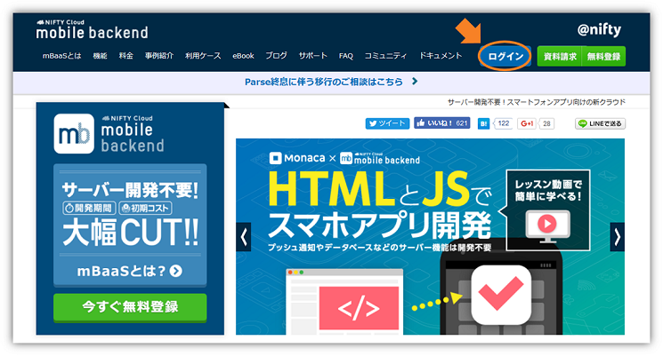
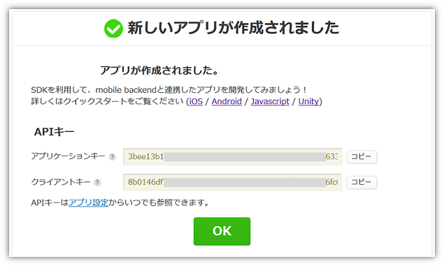
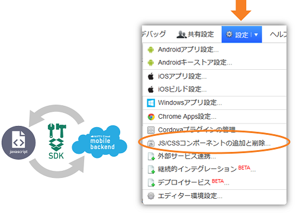

name: inverse
layout: true
class: center, middle, inverse
---
# <span style="font-size: 30%">【Monaca × ニフティクラウド mobile backend】</span><br>アプリに会員認証機能<br>を導入しよう！
富士通クラウドテクノロジーズ株式会社

.footnote[
20170919作成
]

---
layout: true
class: center, middle, inverse_sub
---
# はじめに

---
layout: false

.footnote_right[
概要
]

## 概要
* アプリに会員管理機能を導入したい！
* 既存サービスに会員管理機能を導入したい！
* ログインしないと見られなコンテンツを作りたい！

.size_small_7[
プレミアム会員機能イメージ
]

.center[]


気軽に導入できる「会員認証機能」があったらいいと思いませんか？

---
layout: false

.footnote_right[
概要
]

## 概要
ニフティクラウド mobile backendを使うことで、Monacaで作成した既存アプリにも **簡単に会員認証機能を導入することができます**！

.center[]

本セミナーではその導入手順と実装コードの解説を行います。

---
.footnote_right[
概要
]
### Monacaって何？
* __もなか 【[Monaca](https://ja.monaca.io/)】__ HTML5/JavaScript/CSS3でスマホアプリが開発できる開発環境。開発スタイル／コーディング環境は選択可能。

.center[]

---
.footnote_right[
概要
]
### ニフティクラウド mobile backend って何？
* __にふてぃくらうど-もばいる-ばっくえんど 【[ニフティクラウド mobile backend](http://mb.cloud.nifty.com/about.htm)】__ スマートフォンアプリに必要なバックエンド機能が開発不要で利用できるクラウドサービス。 クラウド上に用意された機能をAPIで呼び出すだけで利用できます。また、APIを簡単に使うためのSDKを用意しています（ iOS / Android / Monaca / Unity ）。mobile Backend as a Service の頭文字を取って、通称 **mBaaS** と呼ばれています。

.center[]

---
.footnote_right[
概要
]

### Monaca と mBaaS で<br>サーバー連携アプリは簡単に実現可能に
この２つを組み合わせると、高度なアプリも簡単スピーディーに開発できます

.center[]

.left-column[
__《アプリ側》Monaca のすごいところ__
.size_small_7[
* 無料で使える！
* iOS / Android 同時に開発可能！
* いつでもどこでも、ブラウザで開発OK！
* **mBaaSのSDK導入** がクリックだけで簡単に！
]
]
.right-column[
__《サーバー側》mBaaS のすごいところ__
.size_small_7[
* 無料で使える！
* **バックエンドの開発・運用は一切不要**！
* ログイン処理はたった **１行** で実装可能！
* **ダッシュボード** からクラウドの状況をパッと確認できる！
]
]

---
.footnote_right[
概要
]

### 今回体験する内容
#### 会員認証機能の導入方法について学びます
* ニフティクラウド mobile backend で用意している __３つの認証方法__ についてそれぞれ実装方法をサンプルアプリを利用して解説します

#### ３つの認証方法
* ID / パスワード 認証
* メールアドレス / パスワード認証
* 匿名認証

.center[]

---
.footnote_right[
概要
]
### ３つの認証方法
#### ID / パスワード 認証
* 会員が設定したIDとPWを使用して簡単に認証ができます

.center[]

---
.footnote_right[
概要
]
### ３つの認証方法
#### メールアドレス / パスワード 認証
* 登録メールアドレスに届くパスワード設定用のメールでパスワードを設定することでアカウントを作成します
* 有効なメールアドレスであることを確認した上で認証を行うことができます

.center[]

---
.footnote_right[
概要
]
### ３つの認証方法
#### 匿名認証
* 会員情報を入力することなくログインを行うことができます
* 一度ログアウトして再び匿名認証でログインをすると別会員として登録されるため「アプリを使い始めてもらうまで __仮会員__ として利用する」などの用途があります

.center[]

---
layout: true
class: center, middle, inverse_sub
---
# ハンズオン

---
layout: false

.footnote_right[
.right[
ハンズオン<br>準備
]
]

## 準備
### 事前準備
下記登録を完了し、アカウントを作成しておいてください

* [Monaca](https://ja.monaca.io/register/start.html)の利用登録（無料）
* [ニフティクラウド mobile backend (mBaaS)](http://mb.cloud.nifty.com/signup.htm)の利用登録（無料）

### 動作環境準備
* PC
 * Chrome 最新版

---
.footnote_right[
.right[
ハンズオン<br>作業手順
]
]

## 作業手順
.size_large_13[
1. Monacaの準備
1. mBaaSの準備
1. mBaaS Javascript SDK の導入と初期化
1. 動作確認と実装コード解説
  * ID / パスワード認証
  * メールアドレス / パスワード認証
  * 匿名認証
]

* 今回はmBaaSとの連携部分をよりわかりやすく理解するために、コーディング済みのプロジェクトを用意しました
* Monaca にプロジェクトをインポートして使用します

---
.footnote_right[
.right[
ハンズオン<br>1. Monacaの準備
]
]

### 1. Monacaの準備
* Monacaにログインをします

.center[]
https://ja.monaca.io/

---
.footnote_right[
.right[
ハンズオン<br>1. Monacaの準備
]
]
* プロジェクトをインポートします
* 「Import Project」をクリックすると、「プロジェクトのインポート」画面が表示されます
* 「プロジェクト名」を入力します　例）.color_blue[__会員認証Demoアプリ__]
* 「インポート方法」では、「URLを指定してインポート」を選択し、次のURLを入力します<br>`https://github.com/natsumo/MonacaUserDemoApp/archive/master.zip`

.center[]
---
.footnote_right[
.right[
ハンズオン<br>1. Monacaの準備
]
]

* プロジェクトが作成されたら、「開く」をクリックします
* プロジェクトが開かれます

.center[]

これでMonacaの準備は完了です

---
.footnote_right[
.right[
ハンズオン<br>2. mBaaSの準備
]
]
### 2. mBaaSの準備
* mBaaS にログインします

.center[]
http://mb.cloud.nifty.com/

---
.footnote_right[
.right[
ハンズオン<br>2. mBaaSの準備
]
]
<br>
* 新しいアプリを作成します
* アプリ名を入力し、「新規作成」をクリックします　例）.color_blue[__UserDemo__]

.center[]

* mBaaSを既に使用したことがある場合は、画面上方のメニューバーにある「+新しいアプリ」をクリックすると同じ画面が表示されます

.center[]

---
.footnote_right[
.right[
ハンズオン<br>2. mBaaSの準備
]
]
<br><br>
* アプリが作成されるとAPIキー（２種類）が発行されます
 * APIキーは後で使用します
* ここでは使用しないので、「OK」で閉じます

.center[]

---
.footnote_right[
.right[
ハンズオン<br>2. mBaaSの準備
]
]
<br>
* ダッシュボードが表示されます

.center[]

* 次に、会員管理機能を利用するための設定を行います

---
.footnote_right[
.right[
ハンズオン<br>2. mBaaSの準備
]
]

<br>

* 今回利用する３つの会員認証機能について利用許可設定を行います
* 右上の「アプリ設定」から「会員認証設定」、「基本」を開き、<br>それぞれ「許可する」を選択して「保存する」をクリックします

.center[]

* これでmBaaSの準備は完了です

---
.footnote_right[
.right[
ハンズオン<br>3. mBaaS Javascript SDK の導入と初期化
]
]
### 3. mBaaS Javascript SDK の導入と初期化
* アプリのmBaaSを利用するためのSDKを導入します
* Monacaを開きます
* 上部メニューバーから「設定」＞「JS/CSSコンポーネントの追加と削除...」をクリックします
.center[]

---
.footnote_right[
.right[
ハンズオン<br>3. mBaaS Javascript SDK の導入と初期化
]
]
<br><br>
* 「コンポーネント」の右のテキストフィールドに「`ncmb`」と入力し、「検索」をクリックします

.center[]

---
.footnote_right[
.right[
ハンズオン<br>3. mBaaS Javascript SDK の導入と初期化
]
]
* 「ncmb」と表示されるので、「追加」をクリックします
* SDKのバージョンはそのまま（最新版を指定）で、「インストール」をクリックします
* 「`components/ncmb/ncmb.min.js`」のチェックボックスにチェックを入れて「保存する」をクリックします

.center[]

---
.footnote_right[
.right[
ハンズオン<br>3. mBaaS Javascript SDK の導入と初期化
]
]
<br><br>
* 下記のように表示されれば導入完了です！

.center[]

---
.footnote_right[
.right[
ハンズオン<br>2. SDKの初期化
]
]
* 導入したSDKを初期化して使用できる状態にします
* `www/js/app.js`を開きます

.center[]

---
.footnote_right[
.right[
ハンズオン<br>2. APIキーの設定
]
]
<br><br>
* １行目「APIキーの設定」にmBaaSでアプリ作成時に発行されたAPIキーを設定します

.center[]

* mBaaS のダッシュボードから、<br>APIキー（アプリケーションキーとクライアントキー）をコピーして、<br>それぞれ`YOUR_NCMB_APPLICATION_KEY`と`YOUR_NCMB_CLIENT_KEY`に貼り付けます
* このとき、ダブルクォーテーション「`"`」は消さないように注意しましょう

---
.footnote_right[
.right[
ハンズオン<br>2. APIキーの設定
]
]
<br>
* APIキーはmBaaSのダッシュボード「アプリ設定」＞「基本」で確認できます

.center[]

---
.footnote_right[
.right[
ハンズオン<br>3. 読み込むJavaScriptファイルの変更
]
]

* １行目で設定したAPIキーは、５行目「SDKの初期化」で初期化をしています

.center[]

* 作成したインスタンス「`ncmb`」を使うことで、mBaaSの機能を使用できます
* 作業は以上です！

#### .color_blue[作業が完了したら保存を忘れずに！]
* メニューバーの「保存」をクリックします
 * Windowsの場合は、「Ctrl + S」でも保存できます
 * Macの場合は、「Command + S」でも保存できます

ここからは動作確認をしながら実装コードを見ていきましょう！

---
.footnote_right[
.right[
ハンズオン<br>4. 動作確認と実装コード解説
]
]

### 4. 動作確認と実装コード解説

次の流れで動作確認と実装コードを解説していきます

.size_large_13[
1. ID / パスワード 認証 新規登録
1. ログアウト
1. ID / パスワード 認証 ログイン
1. メールアドレス / パスワード 認証 新規登録
1. メールアドレス / パスワード 認証 ログイン
1. 匿名認証
1. おまけ
]

---
.footnote_right[
.right[
ハンズオン<br>4. 動作確認と実装コード解説
]
]

.size_large_13[
#### 1. ID / パスワード 認証 新規登録
]

* ID / パスワード で新しい会員を作成します

.center[]

* 「登録する」をクリックすると会員情報が登録され、ログイン処理を行います
* ログイン後の画面では作成された会員情報を確認することができます

---
.footnote_right[
.right[
ハンズオン<br>4. 動作確認と実装コード解説
]
]

.size_large_13[
#### 1. ID / パスワード 認証 新規登録
]

.center[]

* 会員が作成されるとmBaaSにはこのような情報が保存されます
* 実際にmBaaSのダッシュボードを確認して、どのように会員情報が保存されているか見てみましょう！

---
.footnote_right[
.right[
ハンズオン<br>4. 動作確認と実装コード解説
]
]

.size_large_13[
#### 1. ID / パスワード 認証 新規登録
]

* mBaaSのダッシュボードを開いて「会員管理」をクリックします

.center[]

* １件データが作成されていることを確認できます
* IDは「userName」として、パスワードは「password」として登録されます
* その他に、mBaaS保有データに自動で割り振られるUUIDとして「objectId」や、会員情報が登録された日時として「createDate」などの値が一緒に保存されます

.size_small_7[
* 注：パスワードは暗号化されるため、<br>　　ダッシュボードからも確認することはできません（仕様）
]

---
.footnote_right[
.right[
ハンズオン<br>4. 動作確認と実装コード解説
]
]

.size_large_13[
#### 1. ID / パスワード 認証 新規登録
]

* 実装コードは以下のように記述しています
 * `wwww/js/app.js` の 13行目以降 `onIDRegisterBtn()` 内参照

```js
// [NCMB] user インスタンスの生成
var user = new ncmb.User();
// [NCMB] ID / PW で新規登録
user.set("userName", username)
    .set("password", password)
    .signUpByAccount()
    .then(function(user) {
        /* 処理成功 */
        // [NCMB] userインスタンスでログイン
        ncmb.User.login(user)
                 .then(function(user) {
                     /* 処理成功 */
                 })
                 .catch(function(error) {
                     /* 処理失敗 */
                 });
    })
    .catch(function(error) {
        /* 処理失敗 */
    });
}
```

---
.footnote_right[
.right[
ハンズオン<br>4. 動作確認と実装コード解説
]
]

.size_large_13[
#### 2. ログアウト

* 一度ログアウトをします

.center[]

]

---
.footnote_right[
.right[
ハンズオン<br>4. 動作確認と実装コード解説
]
]

.size_large_13[
#### 2. ログアウト
]

* 実装コードは以下のように記述しています
 * `wwww/js/app.js` の 185行目以降 `onLogoutBtn()` 内参照

```js
// [NCMB] ログアウト
ncmb.User.logout();
```

---
.footnote_right[
.right[
ハンズオン<br>4. 動作確認と実装コード解説
]
]

.size_large_13[
#### 3. ID / パスワード 認証 ログイン
]

* ログアウトすると、最初の画面（ID / パスワード ログイン画面）に戻ります
* 先ほど新規作成したアカウントでログインしてみましょう

.center[]

* 会員情報が表示されればとログイン成功です

---
.footnote_right[
.right[
ハンズオン<br>4. 動作確認と実装コード解説
]
]

.size_large_13[
#### 3. ID / パスワード 認証 ログイン
]

* 既存会員データと照合してログインを行います
* 実装コードは以下のように記述しています
 * `wwww/js/app.js` の 65行目以降 `onIDLoginBtn()` 内参照

```js
// [NCMB] ID / PW でログイン
ncmb.User.login(username, password)
         .then(function(user) {
             /* 処理成功 */
         })
         .catch(function(error) {
             /* 処理失敗 */
         });
```

.size_small_7[
* ログイン処理は、２パターンあります◎
 1. 会員情報のインスタンスで行う場合（新規登録処理で使用）<br>`.login(user)`
 1. ID/パスワードで行う場合（ログイン処理で使用）<br>`.login(username, password)`
]

---
.footnote_right[
.right[
ハンズオン<br>4. 動作確認と実装コード解説
]
]

.size_large_13[
#### 4. メールアドレス / パスワード 認証 新規登録
]

* 再度ログアウトをします
* 次にメールアドレス / パスワード 認証を行います
* 「メールアドレス / PW 新規登録」画面を開き、会員登録を行います

.center[]

---
.footnote_right[
.right[
ハンズオン<br>4. 動作確認と実装コード解説
]
]

.size_large_13[
#### 4. メールアドレス / パスワード 認証 新規登録
]

* メールアドレスを入力します

.size_small_7[
* メールアドレスでの認証の場合は、パスワードの設定を登録したメールアドレスに配信されるメールにて行うため、 __有効なメールアドレス__ を設定する必要があります
]

.center[]

* 届いたメールのURLをクリックします

---
.footnote_right[
.right[
ハンズオン<br>4. 動作確認と実装コード解説
]
]

.size_large_13[
#### 4. メールアドレス / パスワード 認証 新規登録
]

* パスワードを設定します

.center[]

---
.footnote_right[
.right[
ハンズオン<br>4. 動作確認と実装コード解説
]
]

.size_large_13[
#### 4. メールアドレス / パスワード 認証 新規登録
]

* 設定完了メールが届きます

.center[]

* 会員情報が登録されたことを、mBaaSのダッシュボードで確認しましょう

---
.footnote_right[
.right[
ハンズオン<br>4. 動作確認と実装コード解説
]
]

.size_large_13[
#### 4. メールアドレス / パスワード 認証 新規登録
]

* 会員が１件追加されたことが確認できます

.center[]

* メールアドレス認証の場合は`userName`と`password`が自動的に設定されます
  * この`userName`を利用して ID / パスワード 認証 でのログインが可能です
* `mailAddressConfirm`の値（`true`/`false`）はメールにてPW設定を行った場合に`true`が設定されます
  * ID / PW 認証の会員にも追加でメールアドレスの設定が可能です。<br>この場合は`false`が設定されます。

---
.footnote_right[
.right[
ハンズオン<br>4. 動作確認と実装コード解説
]
]

.size_large_13[
#### 4. メールアドレス / パスワード 認証 新規登録
]

* 実装コードは以下のように記述しています
 * `wwww/js/app.js` の 99行目以降 `onEmailRegisterBtn()` 内参照

```js
// [NCMB] メールアドレス に会員登録を行うためのメールを送信
ncmb.User.requestSignUpEmail(mailAddress)
         .then(function(user){
             /* 処理成功 */
         })
         .catch(function(error){
             /* 処理失敗 */
         });
```

---
.footnote_right[
.right[
ハンズオン<br>4. 動作確認と実装コード解説
]
]

.size_large_13[
#### 4. メールアドレス / パスワード 認証 新規登録
]

* 参考
  * 会員登録時に配信されるメールの文章や、パスワード登録画面デザインや自由にカスタマイズ可能です

.size_small_7[
* 「アプリ設定」＞「会員設定」の「メールの文面」、「カスタムページ」参照
]

.center[]

---
.footnote_right[
.right[
ハンズオン<br>4. 動作確認と実装コード解説
]
]

.size_large_13[
#### 5. メールアドレス / パスワード 認証 ログイン
]

* ログインしてみましょう
* 登録後の画面またはフッターの真ん中のボタンをクリックしてメールアドレスとパスワードを入力します

.center[]


---
.footnote_right[
.right[
ハンズオン<br>4. 動作確認と実装コード解説
]
]

.size_large_13[
#### 5. メールアドレス / パスワード 認証 ログイン
]

* 実装コードは以下のように記述しています
 * `wwww/js/app.js` の 128行目以降 `onEmailLoginBtn()` 内参照

```js
// [NCMB] メール / PW でログイン
ncmb.User.loginWithMailAddress(mailAddress, password)
         .then(function(user) {
             /* 処理成功 */
         })
         .catch(function(error) {
             /* 処理失敗 */
         });
```

---
.footnote_right[
.right[
ハンズオン<br>4. 動作確認と実装コード解説
]
]

.size_large_13[
#### 6. 匿名認証
]

* 一度ログアウトをします
* 最後に匿名認証でログインしてみましょう

.center[]

---
.footnote_right[
.right[
ハンズオン<br>4. 動作確認と実装コード解説
]
]

.size_large_13[
#### 6. 匿名認証
]

* 匿名会員として一回のログイン中のみ使用可能なアカウントが作成されます

.center[]

* メールアドレス認証と同様、自動で`userName`と`password`が割り振られます
* 匿名会員では`authData`が設定されていることが確認できます
* 会員情報が登録されたことを、mBaaSのダッシュボードを確認しましょう

---
.footnote_right[
.right[
ハンズオン<br>4. 動作確認と実装コード解説
]
]

.size_large_13[
#### 6. 匿名認証
]

* `authData`にSDKの内部で発行したIDを設定して会員データを作成しています
  * 例：`{"anonymous":{"id":"6f9cb6aa-be0f-6756-6fd9-c58a5ae737ad"}}`
* 匿名会員情報はログアウト（またはセッション切れ）で破棄され、無効な会員データとなります
  * 再び匿名会員としてログインを行うと別の会員として登録されます

.center[]

* ログイン後にIDとパスワードを設定（会員情報の更新処理）することで、<br> __通常の会員に変更__ することも出来ます


---
.footnote_right[
.right[
ハンズオン<br>4. 動作確認と実装コード解説
]
]

.size_large_13[
#### 6. 匿名認証
]

* 実装コードは以下のように記述しています
 * `wwww/js/app.js` の 161行目以降 `onAnonymousLoginBtn()` 内参照

```js
// [NCMB] 匿名 でログイン
ncmb.User.loginAsAnonymous()
         .then(function(user){
             /* 処理成功 */
         })
         .catch(function(error){
             /* 処理失敗 */
         });
```

---
.footnote_right[
.right[
ハンズオン<br>4. 動作確認と実装コード解説
]
]

.size_large_13[
#### 7. おまけ
]

#### 現在ログイン中の会員を取得

```js
// [NCMB] ログイン中の会員情報の取得
currentLoginUser = ncmb.User.getCurrentUser();
```

#### 認証有効時間（セッション）の設定
* デフォルトでは 24時間 で設定されています（最大168時間）

.center[]


---
## まとめ

.size_large_13[
__３つの会員認証機能を体験しました！__

1. ID / PW 認証
2. メールアドレス / PW 認証
3. 匿名認証
]

* 会員管理機能の導入は mBaaS で簡単に実現可能！
 * Monaca なら JavaScript SDK が利用できるから実装も簡単！既存アプリにもすぐに導入可能！
* ID / PW で気軽な会員管理を実現！
* メールアドレス / PW で不正な会員登録を防ぎ、確実な会員管理を！
* 仮会員として匿名認証を上図に利用することで、通常会員化の導線が作れる！

---
layout: true
class: center, middle, inverse_sub
---
# おわりに

---
layout: false

## おわりに
いかがでしたでしょうか？こんなに使いやすくて便利なmBaaSをもっと活用してみたい方へ、mBaaSの各機能をすぐに試すことができるサンプルアプリを多数ご用意しています。Monacaにサンプルプロジェクトをインポートして、簡単な操作をするだけですぐにお試しいただけます！ぜひご活用ください。

.size_large_11[
* [mobile backend を体験しよう！](https://github.com/NIFTYCloud-mbaas/monaca_data_registration)
 * 使用機能 / データストア
* [アプリにプッシュ通知を組み込もう！](https://github.com/NIFTYCloud-mbaas/MonacaPushApp)
 * 使用機能 / プッシュ通知
* [地図アプリを作ろう！](https://github.com/NIFTYCloud-mbaas/MonacaMapApp)
 * 使用機能 / データストア,位置情報検索
* [and more...](http://mb.cloud.nifty.com/doc/current/tutorial/tutorial_monaca.html)
]

---
## 本日の資料配布について
.size_small_9[
アンケートをご回答いただいた方に資料URLをお送りします。ご協力をお願いします。
]

### 配布予定資料「アプリに会員認証機能を導入しよう！」
.size_small_9[
ニフティクラウド mobile backendを使うことで、<br>**既存Monacaアプリにも簡単に会員認証機能を導入可能** できます！
]

.center[]

---
layout: true
class: center, middle, inverse_sub
---
.center[
## ご清聴ありがとうございました！
]
